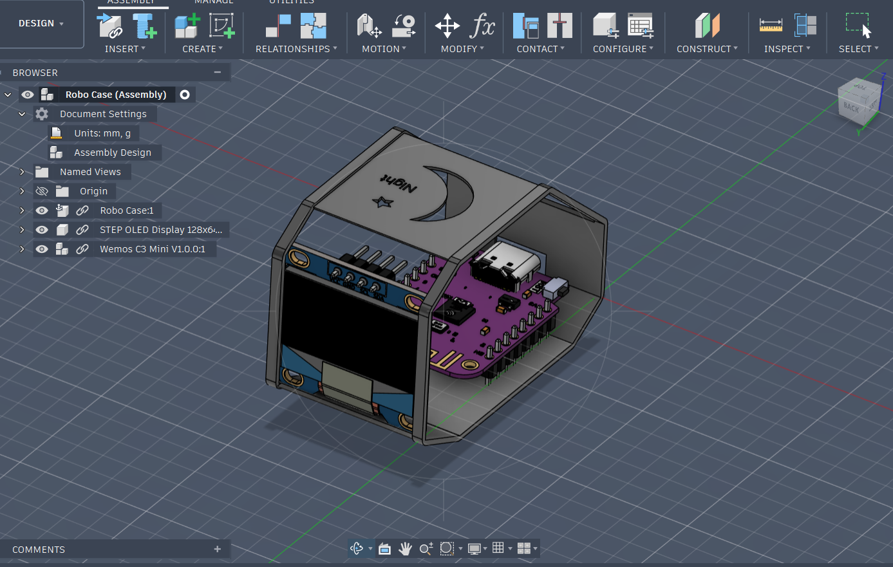
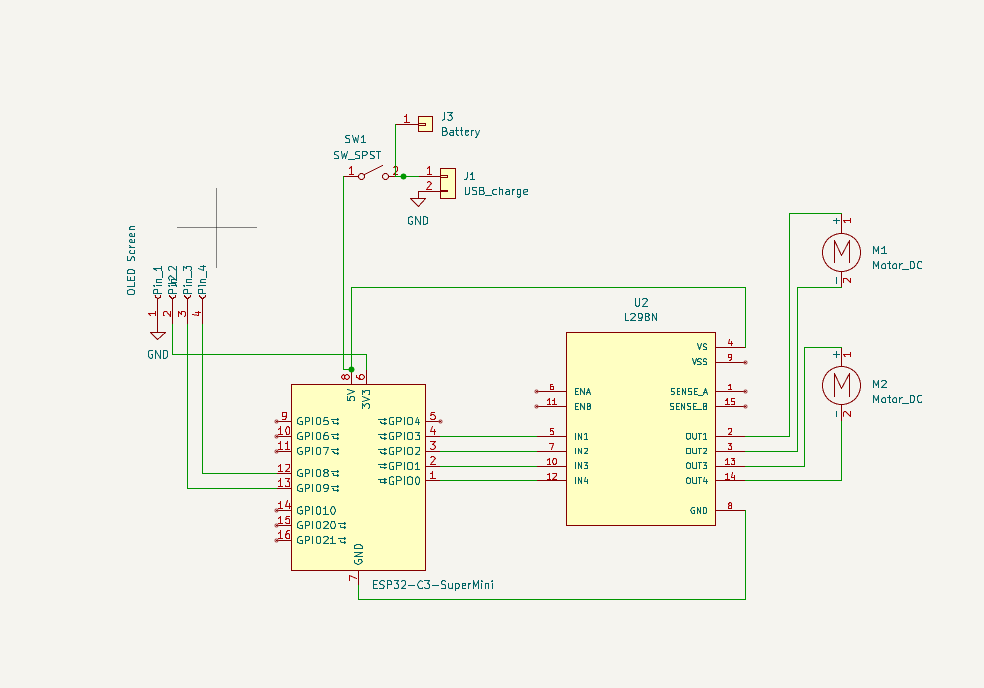

# Robo-Desk
A desk robot, inspired by Huy Vector's DIY project. Function: Move around table and have different moods. Use Flux_Garage library for Robo's mood changes. 

### Materials:

- 1 USB Charging Module
- Copper Wire (0.7mm)
- Copper Wire (0.4mm)
- Toggle Switch Handle Length 3mm
- 2 Steel Gear Motor
- OLED Display 0.95" inch
- 2 DC Gear Electric Motor
- 3.7V 4.2V18650 Lithium Battery Charging
- ESP32 c3

### Inspiration

- Huy Vector's Momochan design and Flux_Garage library

### Challenges
- Programming is a big part of this project. Hence, I tried to learn the language and the library. The library was easy to learn, just the programming language that posed an issue as I'm still unfamiliar with this. 

Case            |  Schematic         |  
:-------------------------:|:-------------------------:|
  |    | 

### Bill of Materials
Materials,Purpose,Quantity,Cost,Distributor,LINK
USB Charging module,Charging,1,8,Amazon,https://www.amazon.com/UMLIFE-Ultra-Mini-Charger-Charging-Protection/dp/B0BRXYZTWN?dib=eyJ2IjoiMSJ9.B5sBR_e3OJa-nvBOr2e9j6ci6SNwEBTorbVTpr-gkAEmA4B08qfgq_xD1SEHiJ3PewKiXpQtvZ39NFryxfitoDYqKNttIvDLX1SclQk7Cg93qgz7TAQU3pnmRZQX_pzT6tnYfGGgS2-HqGQo34OOm7Y3SyJ-LZ0w1_yw4xDrRc-IHrm7W0i-Sg-eE9W7C66E4vBthaKKcjAIPn7OPGqNOYAjrUOASFiHlV0vmQe255A.ufH28AJQK7TaZbHxpwBkU5M5-ds04b4b3eFtcVndJwE&dib_tag=se&keywords=Type-C%2Bcharging%2Bmodule%2B(4.2V)&qid=1769701070&sr=8-1&th=1&linkCode=sl1&tag=huyvector-20&linkId=cf5c27f185eb5a449ababf4bdb8a1b3a&language=en_US&ref_=as_li_ss_tl
Copper Wire (0.7mm),Connect components,1,4,Aliexpress,https://www.aliexpress.us/item/3256805736252226.html?spm=a2g0o.productlist.main.2.5ac657e18K3Sa7&algo_pvid=6cbc0be3-4e8f-4ade-8821-d0db8b23f4d2&algo_exp_id=6cbc0be3-4e8f-4ade-8821-d0db8b23f4d2-1&pdp_ext_f=%7B%22order%22%3A%2225%22%2C%22eval%22%3A%221%22%7D&pdp_npi=6%40dis%21VND%21237395%21163782%21%21%2158.50%2140.36%21%40212e508f17568332917295420e626b%2112000034866213732%21sea%21VN%216215442996%21ABX%211%210%21n_tag%3A-29910%3Bd%3Aa20d48cb%3Bm03_new_user%3A-29895&curPageLogUid=gqgpVjlTYrfU&utparam-url=scene%3Asearch%7Cquery_from%3A%7Cx_object_id%3A1005005922566978%7C_p_origin_prod%3A&aff_fcid=a38faa4df51040feb739c7b636aef426-1780018343307-02726-_omCvfhz&tt=CPS_NORMAL&aff_fsk=_omCvfhz&aff_platform=portals-tool&sk=_omCvfhz&aff_trace_key=a38faa4df51040feb739c7b636aef426-1780018343307-02726-_omCvfhz&terminal_id=9e4e7db24e1c489c8b36f19aa956ab3e&afSmartRedirect=y&gatewayAdapt=vnm2usa4itemAdapt
Switch,Control robot's power,1,1,Aliexpress,https://www.aliexpress.us/item/3256805447103314.html?spm=a2g0o.detail.pcDetailTopMoreOtherSeller.1.58a9Xj64Xj64vq&gps-id=pcDetailTopMoreOtherSeller&scm=1007.40050.354490.0&scm_id=1007.40050.354490.0&scm-url=1007.40050.354490.0&pvid=f5e80c14-8ea6-47e7-ad3b-315c7ac32933&_t=gps-id%3ApcDetailTopMoreOtherSeller%2Cscm-url%3A1007.40050.354490.0%2Cpvid%3Af5e80c14-8ea6-47e7-ad3b-315c7ac32933%2Ctpp_buckets%3A668%232846%238115%232000&pdp_ext_f=%7B%22order%22%3A%221240%22%2C%22eval%22%3A%221%22%2C%22sceneId%22%3A%2230050%22%2C%22fromPage%22%3A%22recommend%22%7D&pdp_npi=6%40dis%21VND%2115657%2113337%21%21%210.54%210.46%21%402102f0cc17604135833292280e0d1f%2112000033823089887%21rec%21VN%216215442996%21XZ%211%210%21n_tag%3A-29919%3Bd%3Aa20d48cb%3Bm03_new_user%3A-29895&utparam-url=scene%3ApcDetailTopMoreOtherSeller%7Cquery_from%3A%7Cx_object_id%3A1005005633418066%7C_p_origin_prod%3A&aff_fcid=7796ac285e574dc388a8b9252abbfa9f-1780018263055-04429-_c3F1y5i3&tt=CPS_NORMAL&aff_fsk=_c3F1y5i3&aff_platform=portals-tool&sk=_c3F1y5i3&aff_trace_key=7796ac285e574dc388a8b9252abbfa9f-1780018263055-04429-_c3F1y5i3&terminal_id=9e4e7db24e1c489c8b36f19aa956ab3e&afSmartRedirect=y&gatewayAdapt=vnm2usa4itemAdapt
Steal Gear,Wheels,2,9,Amazon,"https://www.amazon.com/ShareGoo-Differential-Replacement-Volcano-Monster/dp/B075NYPT43?crid=TE3VCOZIYUJY&dib=eyJ2IjoiMSJ9.NAPJYMyZaz_TzOTYuLORh99xR38QqYyGBs_R9LHeAKlvh8BaIOL4nujCHFWMBcZdvJiENblxNA802oxkXv7IFGd8T8YAy-QXNpCyA_8dYBcYgtTdgyML_WyNPs-6FYMEwzmj55g6TRK4aX1HGzvxXBc5chDEkNo_o2eLLp85RidjG6gHBDuMMeZxTBZFGiI8qjQ00zzluG9PTkJFX4IIPOtehwr0DZSoOOkFLpW9V_Vjooy7nMNGIR6pL3XgL9g7tg93_n8JyXcGgCrX0lijxOgsa_12jZuMymu80oEzF2I.E0Q4F3591vxz1TM2kf4SNPnm5NCLxcl8GyY9l10BvrY&dib_tag=se&keywords=HSP+Steel+Metal+Spur+Differential+Main+Gear+17T/21T/26T/29T/64T+Pinion+Gear&nsdOptOutParam=true&qid=1769702633&sprefix=hsp+steel+metal+spur+differential+main+gear+17t/21t/26t/29t/64t+pinion+gear,aps,361&sr=8-6&linkCode=sl1&tag=huyvector-20&linkId=c791022cc4d603c3c423ef223ee78032&language=en_US&ref_=as_li_ss_tl"
DC Gear Motor,Motor driver for wheels,2,8,Amazon,https://www.amazon.com/Antrader-Electric-GA12-N20-Deceleration-Reduction/dp/B07FYBQ7Z4?pd_rd_w=XH1AS&content-id=amzn1.sym.2cd14f8d-eb5c-4042-b934-4a05eafd2874&pf_rd_p=2cd14f8d-eb5c-4042-b934-4a05eafd2874&pf_rd_r=VTGQE8JK2ZD3592QKRVC&pd_rd_wg=gwzZF&pd_rd_r=c0ec9c8a-b3f6-4f4a-86a4-ad5432a9068f&pd_rd_i=B07FYBQ7Z4&th=1&linkCode=sl1&tag=huyvector-20&linkId=270cc51e45199570c48a986439e4b943&language=en_US&ref_=as_li_ss_tl
3.7V Lithium Battery Charging,Battery for robo,1,6,Aliexpress,https://www.aliexpress.us/item/3256809368971829.html?spm=a2g0o.productlist.main.12.699a6d809lUt9W&aem_p4p_detail=20250902103741724609948102140006170319&algo_pvid=cb2859e4-26d9-4bde-8628-9a3c5294aec0&algo_exp_id=cb2859e4-26d9-4bde-8628-9a3c5294aec0-11&pdp_ext_f=%7B%22order%22%3A%222%22%2C%22eval%22%3A%221%22%7D&pdp_npi=6%40dis%21VND%218116%216980%21%21%212.00%211.72%21%402141115b17568346607144928e4e0a%2112000049452485420%21sea%21VN%216215442996%21ABX%211%210%21n_tag%3A-29910%3Bd%3Aa20d48cb%3Bm03_new_user%3A-29895&curPageLogUid=3lIXjdUCW6oQ&utparam-url=scene%3Asearch%7Cquery_from%3A%7Cx_object_id%3A1005009555286581%7C_p_origin_prod%3A&search_p4p_id=20250902103741724609948102140006170319_3&aff_fcid=5a28e60efb5345098806f8f4937c79dc-1780000258153-00587-_olOxhTt&tt=CPS_NORMAL&aff_fsk=_olOxhTt&aff_platform=portals-tool&sk=_olOxhTt&aff_trace_key=5a28e60efb5345098806f8f4937c79dc-1780000258153-00587-_olOxhTt&terminal_id=9e4e7db24e1c489c8b36f19aa956ab3e&afSmartRedirect=y&gatewayAdapt=vnm2usa4itemAdapt
ESP32 C3,Controlling and communicate ,1,11,Amazon,"https://www.amazon.com/DWEII-ESP32-C3-Development-Supermini-Bluetooth/dp/B0G5XS345R?crid=3O9GVBR5CUDT8&dib=eyJ2IjoiMSJ9.TUcu_JgOx4dykbtNXTKjdR-k48lzS_Ap9jpnEUryNUwEfU4Ny8FwcpP2ZzsM_V8m2nFmxJJpPNr-2IrrjjDzDef4S7pqDBubyU--_nRV_D51HQkA4KG5CZxgZj-xW3a1ltUT7XDsjZSW3-lHN_45IZlps0oC3eUpJVu8WuqFXSlLk_aaZi-buRrc87D7ZK9nOo4013AiPRzikqxlnd9lbdFEcQBc8phpO4sztBbMpCY.qN2yITVQdLXWODsfPpZIoynJVarc5zTcO50HgiVsYv8&dib_tag=se&keywords=esp32c3&qid=1769702045&sprefix=esp32c3,aps,378&sr=8-3&linkCode=sl1&tag=huyvector-20&linkId=452d42c67c65f00a6d54905d0d0981cf&language=en_US&ref_=as_li_ss_tl"

